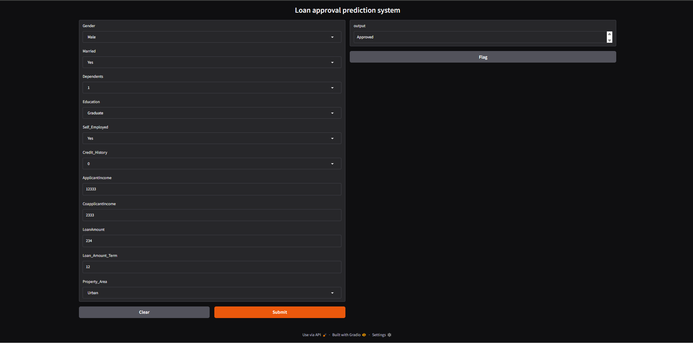
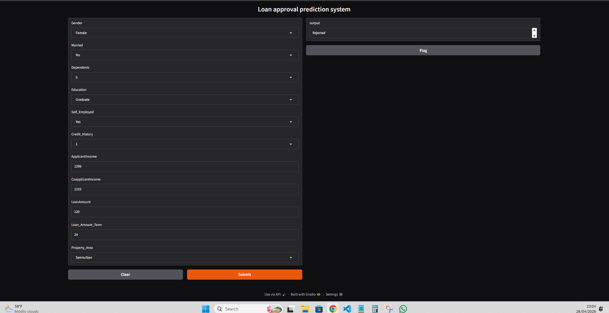

#  Loan Approval Prediction System

This project is a Machine Learning-based web application that predicts whether a loan application will be **Approved** or **Rejected** based on applicant details.

---

##  Project Overview

The system uses a trained Machine Learning model to analyze user inputs such as income, credit history, and other personal details, and predicts loan approval status.

A user-friendly interface is built using **Gradio**, allowing real-time predictions.

---

##  Dataset Features

The model uses the following input features:

- Gender
- Married
- Dependents
- Education
- Self_Employed
- ApplicantIncome
- CoapplicantIncome
- LoanAmount
- Loan_Amount_Term
- Credit_History
- Property_Area

---

##  Technologies Used

- Python 
- Pandas
- Scikit-learn
- Gradio
- Joblib

---

##  Machine Learning Pipeline

1. Data Loading  
2. Data Preprocessing  
   - Handling missing values  
   - Encoding categorical variables  
   - Feature selection  
3. Model Training (Random Forest Classifier)  
4. Cross Validation  
5. Hyperparameter Tuning (GridSearchCV)  
6. Model Evaluation  

---

##  Web Application

The application is built using **Gradio** and allows users to:

- Enter applicant details  
- Get instant prediction (Approved / Rejected)  

---

